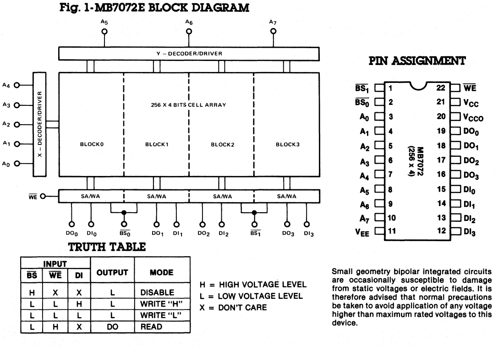
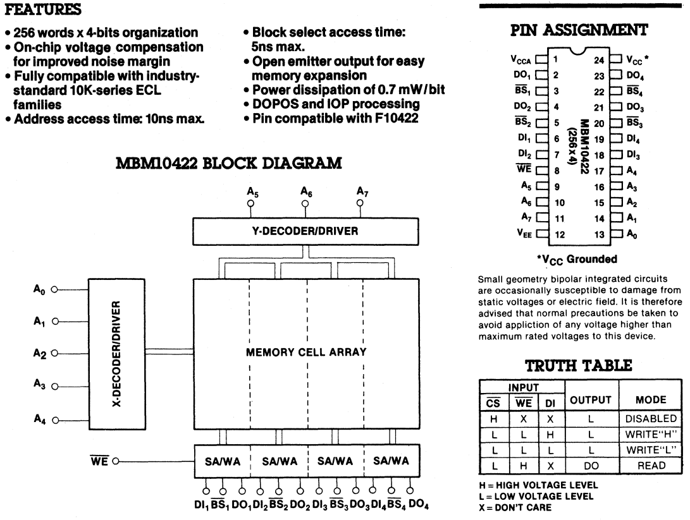
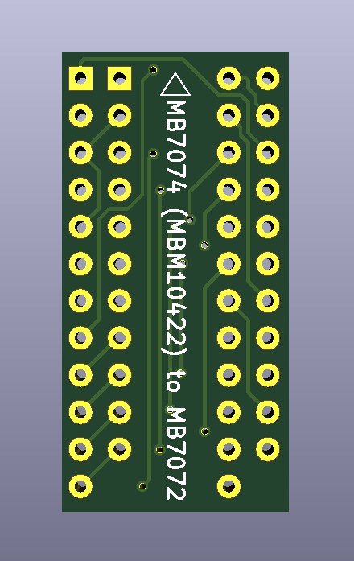
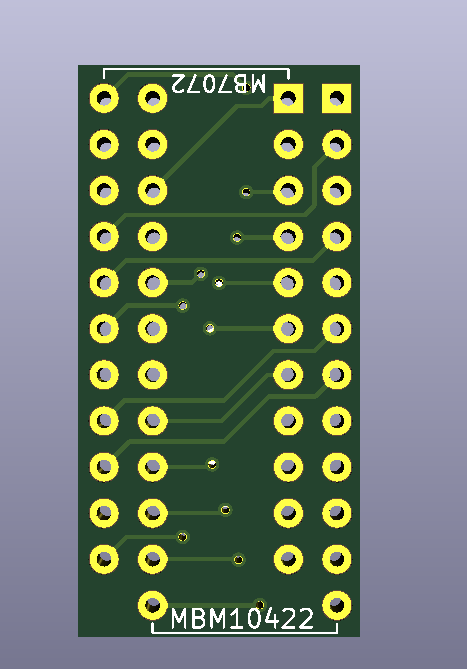

# MB7074 (10422) to MB7072 ECL RAM Adapter
Quick PCB adapter to adapt the more readily available 10422 ECL RAM to the older (and harder to find) MB7072 ECL RAM.This adapter is currently untested, but will be tested in a Radar Scope arcade cabinet soon for functionality.

## Chip differences
The main difference between these two chips is how the block select is done. On the MB7072, there are only two block select signals. On this chip, they basically tie two bit blocks together. So bits 0 and 1 are associated with block select 0, and bits 3 and 4 are associated with block select 1.  
  

With the MB7074, each bit has their own block select signal. So for this to work, block select 1 and 2 have to be tied together and block select 3 and 4 have to be tied together. That way, it will function exactly the same as the MB7072.  
  

## Images
**Board Front**  
  
**Board Back**  
  

## Sources
All information that this adapter (as well as the images detailing how the chips work) is based off of is found at the following resource:  

*Memory Data Book - 1982.* Fujistu Microelectronics, 1982. 
